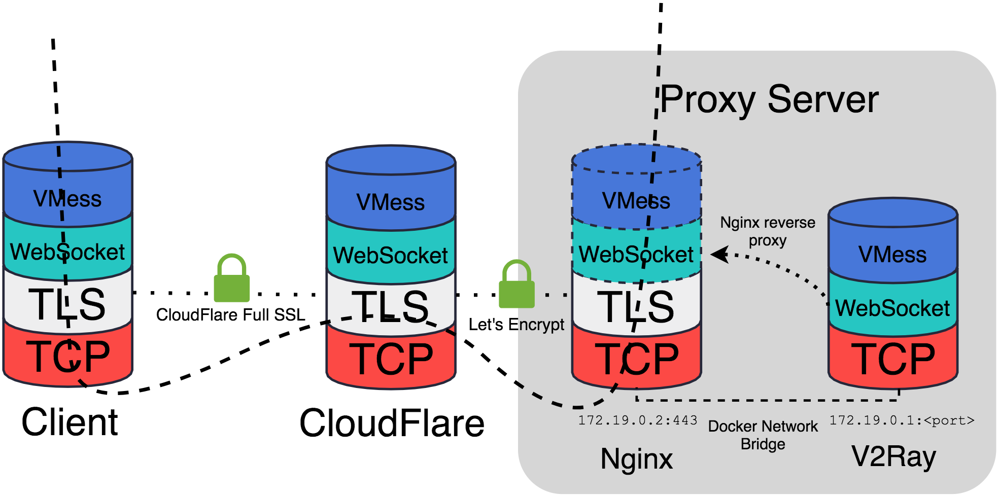

# ProxyChain

### Introduction


### Installation

#### Server

1. Install [Docker](http://lmgtfy.com/?q=how+to+install+docker) and [docker-compose](http://lmgtfy.com/?q=how+to+install+docker-compose).

2. Clone this repository and remove Git tracking

    ```
$ git clone https://github.com/kakugirai/proxychain.git
$ cd proxychain
$ rm -rf .git/
    ```

3. Go to `config.sh` and set your environment variables in the setting field.
4. Run `./config.sh`.
5. Now you should have `server.json`, `docker-compose.yml`, `nginx/` and `nginx.tmpl` in your folder. Check it out.
6. Run `docker-compose up -d`.
7. Go to your CloudFlare DNS setting and make sure the traffic of your virtual host will go through CloudFlare.

#### Client

1. Find a [V2Ray client](https://www.v2ray.com/en/ui_client/) for your device.
2. Simply use `client.json` in your `proxychain` folder.

## License
This library is licensed under the MIT License.